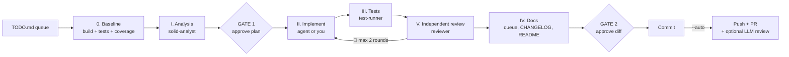

# microtask-pipeline

> **Brings every task to a verifiable outcome, or stops and tells you why.**

[](LICENSE)


A **Claude Code plugin** that turns a plain `TODO.md` into a disciplined, multi-agent delivery pipeline. Each task goes through baseline → analysis → implementation → tests → **independent review** → docs, and every group ends in a commit (or a pull request) with numbers you can check.

AI can write code fast. The hard part is trusting it. microtask-pipeline makes the process **visible, verifiable and small**: one microtask at a time, measured against a baseline, reviewed by an agent that never saw the plan, and stopped the moment something looks wrong.

## Why people use it

- 📏 **Never worse than before.** A full build and test run is taken *before* anything changes. New warnings, failing tests or lower coverage are findings, not surprises.
- 🕵️ **Independent review.** The `reviewer` agent sees only the diff and the public API snapshot, never the plan or the author's intentions, so it judges the code as it is. It also suggests the semver bump.
- 🚦 **You stay in control.** Two approval gates (the plan, then the diff and commit message), or `--auto` to run unattended and land a pull request.
- 🛑 **It stops instead of guessing.** Red tests that weren't red at baseline, an out-of-plan change, a breaking change, unresolved 🔴 findings after two rounds: the pipeline stops and explains why, even in `--auto`.
- 📝 **PRs that humans actually read.** The PR body is a report: behavior changes first, then per task the problem, the impact, what was done in plain words, a table of every file touched with a link to its diff, and baseline → now numbers.
- 🎓 **Learn while you ship.** Mentoring mode lets *you* write the code while the pipeline plans, tests and reviews it, then asks Senior-level questions on your choices. Or let the agent write the code and get the questions on *its* code.
- 🤖 **A second opinion from another model.** Optionally sends the PR diff to any OpenAI-compatible LLM (Groq, Gemini, OpenAI, Mistral, DeepSeek, Ollama…) and posts its review as a PR comment.
- 🗺️ **From roadmap to queue in one command.** `/microtask-pipeline:plan` turns a markdown roadmap into grouped, typed microtasks.
- 🌍 **Speaks your language.** Questions, reports and PRs follow the language you write your tasks in. Code and commits stay in the language you publish in.
- 🧩 **Any stack, .NET first.** Works with dotnet, npm, Python, Go, Rust, Make… With Roslyn MCP it does real C# symbol analysis and public API diffs; with context7 it checks external library signatures against the version you actually use.

## Quick start

```bash
# 1. Install the plugin (from a terminal)
claude plugin marketplace add alexbypa/microtask-pipeline
claude plugin install microtask-pipeline@microtask-pipeline
```

Then, inside a Claude Code session in your project:

```text
# 2. Configure the project: detects build, test and folders, creates the queue
/microtask-pipeline:init

# 3. Run the next group of tasks
/microtask-pipeline:microtask
```

Optional: turn a roadmap into tasks first with `/microtask-pipeline:plan docs/roadmap.md`.

## How it works



| Step | Who | What happens |
|---|---|---|
| **Introduction** | skill | Before anything else: risk to the code (🟢/🟡/🔴 and why), a plain-language preview of each task, and the expected impact on the goals in your `CLAUDE.md` (e.g. NuGet downloads). |
| **0. Baseline** | skill | Full (non-incremental) build and tests, warning count, pre-existing failures, coverage if configured. |
| **I. Analysis** | `solid-analyst` | A plan with files, SOLID notes, risk, breaking changes and a public API snapshot. Fixes come with a plain "problem → why → how we fix it" explanation. |
| **⏸ GATE 1** | you | Approve the plan, or ask for changes. |
| **II. Implementation** | `implementer` or you | Applies only the approved plan. In mentoring you write it. |
| **III. Tests** | `test-runner` | Writes and runs tests, full build, warnings vs baseline, changed-line coverage. |
| **V. Review** | `reviewer` | Independent review of the diff, public API diff, semver bump. 🔴 and small 🟡 go back to II (max 2 rounds). |
| **IV. Memory** | `memory-updater`, `doc-sync-reviewer` | Updates the queue, `CHANGELOG` Unreleased and docs, then checks they match the code. |
| **⏸ GATE 2** | you | Approve the file list, diff stats and commit message. |
| **PR** | skill (`--auto`) | Push, `gh pr create` with a report body, optional LLM review comment. |

**Fast lane.** When the analysis says a change is small (few files, few lines, no public API change, no new dependency, low risk), steps II–IV run inline without subagents. Analysis and the independent review always stay agents, and you can ask for the full lane at GATE 1.

**Review findings.** 🔴 → back to implementation · small 🟡 (≤10 lines, same files, no API change) → fixed in the same round · large 🟡 → proposed at GATE 2 or added to the queue as a follow-up · ⚪ → report only.

## Commands

| Command | What it does |
|---|---|
| `/microtask-pipeline:init` | Configure the project (once) |
| `/microtask-pipeline:plan <roadmap.md> [--prefix R]` | Turn a roadmap into queue rows (asks before writing) |
| `/microtask-pipeline:microtask` | Run the next group in the queue |
| `/microtask-pipeline:microtask A1` | Run only microtask `A1` |
| `/microtask-pipeline:microtask G1` | Run every open microtask of group `G1` |
| `… --manual` | Stop at GATE 1 and GATE 2; no push |
| `… --auto` | No stops at the gates; commit, push and pull request at the end |
| `… --resume` | Resume a microtask paused in mentoring, after you wrote the code |

Without `--auto` or `--manual` the pipeline asks which mode to use.

## Who writes the code

When a group contains `code` tasks, the pipeline always asks who writes the production code (the labels appear in your language):

| Option | What happens |
|---|---|
| `Me (mentoring)` | **You** write the code. The pipeline shows only the signatures (no bodies), saves a resumable plan in `outcomes/microtask/<ID>-plan.md` and stops. Run `--resume` when you're done: it tests and reviews *your* code, gives review fixes in words (no code), then asks 4-5 Senior-level questions and waits for your answers. |
| `Agent + Senior questions` | The agent writes the code and the pipeline **never stops for questions**. The questions on the agent's code are written to the group report, and shown all together at the very end (after the PR in `--auto`), to check you understand its choices. Answer whenever you like. |
| `Agent` | The agent writes the code, no questions. |

Tests are always written by the `test-runner` agent. The recommended option is chosen per group (mentoring for new features and architecture, agent for mechanical fixes) and can be tuned with a project rule in `.claude/rules/mentoring-mode.md`.

## Pull requests in `--auto`

`--auto` approves both gates by itself (each decision is logged in the group report) and ends with `git push` + `gh pr create`, or a comment on the branch's open PR. It never pushes to `main`/`master`.

The PR body is a report for people who didn't follow the work:

- **Behavior changes** first, if any (exceptions, return values, config, API).
- One collapsible block per microtask: **Problem / Impact** (fixes) or **Goal** (features), **What we did** in plain words, and a table of every file touched, each linking to its diff.
- **Verification**: warnings, tests and coverage, baseline → now.
- **Notes**: follow-ups, suggested bump, how the gates went, CI warnings.

**Your language, automatically.** Chat, questions and reports follow the language you write in, and the PR follows the language of the task text in your queue: tasks written in Italian get an Italian PR, tasks in Albanian an Albanian one. No setting needed. Requires the GitHub CLI (`gh`) authenticated.

## Queue format

```markdown
| Status | ID | Group | Type | Task |
|---|---|---|---|---|
| [ ] | A1 | G1 | code | Fix async bug in HttpClientHelper |
| [ ] | A2 | G1 | analysis | Evaluate naming breaking change |
| [ ] | B1 | G2 | docs | README quick start |
| [ ] | C1 | G3 | content | Blog post draft |
```

- **Status:** `[ ]` to do · `[/]` in progress · `[x]` done
- **Group:** one commit (and one PR) per group
- **Type:** `code` full pipeline · `analysis` report in `outcomes/audits/` · `docs` documentation only · `content` drafts in `outcomes/content/` (never published)
- **Headers:** any language works (e.g. `| Stato | ID | Gruppo | Tipo | Task |`): what matters is the column order.
- **Order:** without an ID the pipeline takes the first `[ ]` row from the top and runs its group. Follow-ups are appended at the bottom.

## Configuration

`init` writes a `## Microtask config` section in your project's `CLAUDE.md`:

```markdown
## Microtask config
- Queue: TODO.md
- Done: DONE.md
- Branch: outcome_yyyyMMdd-<Group>
- Build: dotnet build src/MySolution.slnx -c Release
- Test: dotnet test src/MySolution.slnx
- Coverage: dotnet test src/MySolution.slnx -c Release --collect "Code Coverage;Format=cobertura" --results-directory TestResults/coverage
- Watch dir: src
- Docs: README.md, CHANGELOG.md, docs/
- Language: English
- Social drafts: off
```

| Key | Default | Meaning |
|---|---|---|
| `Queue` | `TODO.md` | File with the queue table |
| `Done` | *(none)* | Archive for completed tasks; without it finished rows stay `[x]` in the queue |
| `Branch` | `outcome_yyyyMMdd-<Group>` | Working branch per group |
| `Build` / `Test` | **Commands** section of `CLAUDE.md` | Build and test commands |
| `Coverage` | *(none)* | Test command producing Cobertura XML. Every changed production line must be covered, and global coverage must never drop below the baseline |
| `Watch dir` | `src` | Source folder watched by the doc-sync hook |
| `Docs` | `README.md, CHANGELOG.md` | Docs kept in sync with the code |
| `Language` | `English` | Language of what gets published: code, README, CHANGELOG and commit messages. The conversation always follows your language |
| `Social drafts` | `off` | `on` → a social post draft (Reddit, LinkedIn, X…) for every new feature, in `outcomes/social/`. Never published |

Project rules in `.claude/rules/*.md` are passed to every agent: add project-specific checks there instead of editing the plugin.

## Second-opinion LLM review (optional)

At the end of an `--auto` run the pipeline can send the PR diff to another model and post its review as a PR comment. It works with any OpenAI-compatible chat completions API and has zero dependencies (Node.js 18+). The question is asked at startup only when the review is configured.

Settings come from the environment or the project `.env` (environment wins; keep `.env` in `.gitignore`):

| Variable | Default | Meaning |
|---|---|---|
| `PR_REVIEW_API_KEY` | *(required)* | API key, sent as `Authorization: Bearer` |
| `PR_REVIEW_BASE_URL` | `https://api.groq.com/openai/v1` | Base URL; the script calls `<base>/chat/completions` |
| `PR_REVIEW_MODEL` | `openai/gpt-oss-120b` | Model id |
| `PR_REVIEW_MAX_CHARS` | `16000` | Diff budget (fits the Groq free tier). Production code goes first, then config, then tests; docs and generated files are skipped |
| `PR_REVIEW_MAX_TOKENS` | `4096` | Max tokens of the answer |
| `PR_REVIEW_REASONING_EFFORT` | *(none)* | Optional `reasoning_effort`, for providers that support it |
| `PR_REVIEW_EXCLUDE` | *(none)* | Comma-separated patterns to leave out of the diff; `!pattern` re-includes a default one (e.g. `!*.md`) |

Example for Gemini: `PR_REVIEW_BASE_URL=https://generativelanguage.googleapis.com/v1beta/openai`. Failures never block the pipeline. The diff is sent to the configured provider, private repos included.

## Components

| Type | Name | Model | Writes code? |
|---|---|---|---|
| Skill | `init`, `plan`, `microtask` | — | — |
| Agent | `solid-analyst` | opus | No (read-only) |
| Agent | `implementer` | inherit | Production code only |
| Agent | `test-runner` | sonnet | Tests only |
| Agent | `reviewer` | sonnet | No (read-only) |
| Agent | `memory-updater` | sonnet | Docs only |
| Agent | `doc-sync-reviewer` | sonnet | No (read-only) |
| Agent | `social-writer` | sonnet | Drafts only |
| Hook | `SessionStart` → `config-check.sh` | — | Reminds you to run `init` if the project isn't configured |
| Hook | `Stop` → `doc-sync-gate.sh` | — | Asks for a doc-sync check when `Watch dir` changed; silent while the pipeline runs |

Both hooks do nothing in projects without a `## Microtask config` section.

## Requirements

- Claude Code, Git, Bash (on Windows: Git Bash)
- GitHub CLI (`gh`), authenticated, for `--auto` pull requests
- Optional: `cwm-roslyn-navigator` MCP server for C# symbol analysis and public API diffs (without it agents fall back to Grep/Read)
- Optional: `context7` MCP server for up-to-date library docs during analysis
- Optional: Node.js 18+ for the LLM PR review

Permission prompts are not controlled by the mode. For a run without interruptions, allow the commands in the project `.claude/settings.json`, e.g. `"allow": ["Bash(git push:*)", "Bash(gh pr create:*)", "Bash(gh pr view:*)", "Bash(gh pr comment:*)", "Bash(node *pr-review.mjs*)"]`.

## Updating

```bash
claude plugin marketplace update
claude plugin update microtask-pipeline@microtask-pipeline
```

## Contributing

Issues and pull requests are welcome. The plugin is plain Markdown instructions plus a few small scripts: changing a behavior usually means editing a `SKILL.md` or an agent file. Bump `version` in `.claude-plugin/plugin.json` in every PR that changes behavior.

## License

[MIT](LICENSE) © Alessandro Chiodo
